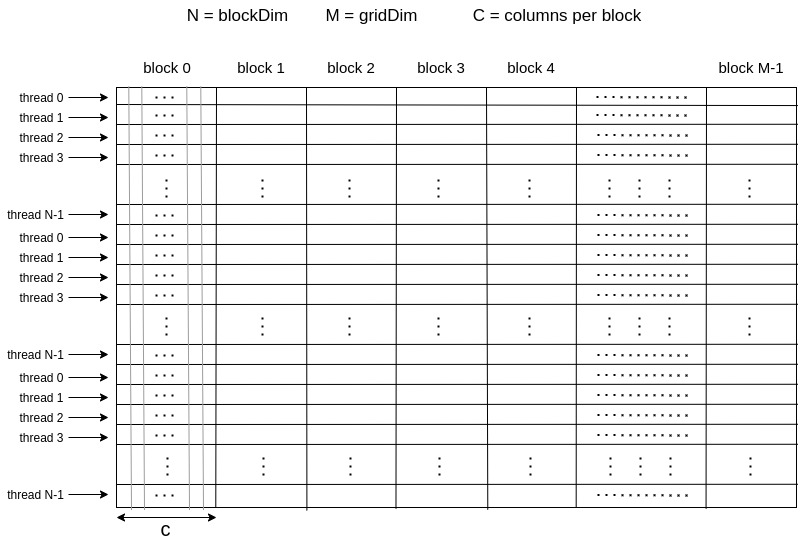

# Gauss-Jordan Elimination In CUDA

Gauss-Jordan Elimination is a way of calculating the inverse of a matrix and solving many linear systems. this is an
Implement matrix inversion using Gauss-Jordan Elimination in CUDA.

## build

first you should build the project with cmake

```bash
cmake CMakeLists.txt
```

after a Makefile built, compile the project by following command:

```bash
make
```

## run

after building the project, you should execute `./GJE` command with following flags:

```bash
./GJE -n <edge_length> [-f <input_matrix_file> | -r <random_uniform_matrix>] -o <calculated_inverse_matrix_path> [-c <execute_on_cpu> | -g <execute_on_gpu>]
```

the program writes the calculation runtime in on stdout (in milliseconds). for example:

```out
calculation time: 120.31(ms)
```

## methodology



We use simple gauss-gordan algorithm and try to port it to GPU through cuda language

the algorithm goes as follow:

1. one kernel creating the identity matrix near to the input matrix

   1.1. each block is responsible for setting neccessory 1 in `COL_PER_BLK` columns (one thread for each column)
   thus `COL_PER_BLK` shoud be less than maximum block size set by GPU hardware
2. for each row:

   2.1. one kernel for calculating factor of which each row is subtracted by the current row (parallelism level: each
   thread is responsible for n/blockDim.x row and thus calculates n/blockDim.x factors)

   2.2. one kernel for subtracting the current row from each row in the matrix and normalizing the current row


## time analysis

given the methodology above our time complexity would be:

$max (kernel_1 ,n*(kernel_2 + kernel_3))$

since first kernel time order in CPU is of O(n) and since we break the execution into $n/COL\_PER\_BLK$ parallel blocks, our
total execution time for the first kernel would be: 

$O(n/(COL\_PER\_BLK * NUM\_SM))$

kernel2 has similar charactristic and its execution time would be:

$O(n/blockDim.x)$

kernel3 on the other hand, for each block, each thread is responsible for n/blockDim.x and each row takes COL_PER_BLK
iterations, so the total execution time for each thread would be:

$O(n*COL\_PER\_BLK/blockDim.x)$

there are a total of n/COL_PER_BLK blocks and only NUM_SM of them can be run in a prallel manner so the total execution
time per each block execution is:

$O(n/(COL\_PER\_BLK*NUM\_SM))$

so the total execution time of kernel3 is:

$O(threads\:execution)* O(blocks\:execution) =\\ O(n*COL\_PER\_BLK/blockDim.x)*O(n/(COL\_PER\_BLK*NUM\_SM)) =\\ O(n^2 /blockDim.x*NUM\_SM))$

and the total execution time would be:

$max(kernel_1+n*(kernel_1+kernel_2))$

which is:

$O(n^3/blockDim.x*NUM\_SM)$

## benchmark

you can run the python benchmark program by following command:

```bash
sudo python test.py 
```

on this benchmark, we've executed the program with random matrix with exponential binary lengths from 2^1 till 2^16.

after each execution on both cpu & gpu, we capture its computation runtime and error.

we calculate matrix error by norm2(Frobenius) method. assume that we've calculated the inverse of matrix A, then we
have:

$error = norm2(I-A*A^{-1})$

we've executed the benchmark on Nvidia RTX2080 & intel i9900k.
